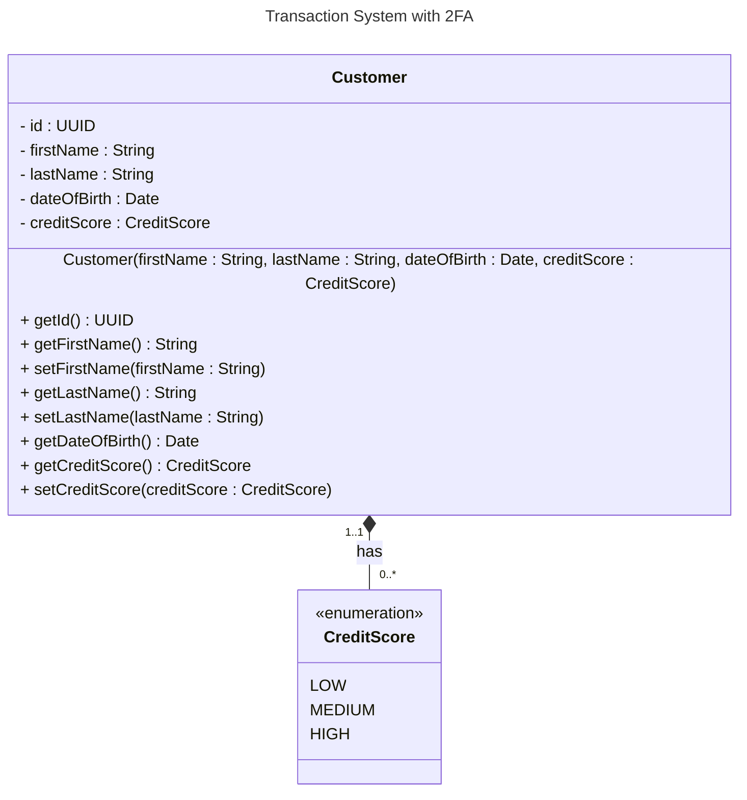

Recommended Editor: 

Build tool: 

Diagrams: [Mermaid](https://mermaid.js.org/intro/)

```mermaid
---
title: Transaction System with 2FA
---
classDiagram
    class Customer {
        - id : UUID
        - firstName : String
        - lastName : String
        - dateOfBirth : Date
        - creditScore : CreditScore

        Customer(firstName : String, lastName : String, dateOfBirth : Date, creditScore : CreditScore)
        + getId() UUID
        + getFirstName() String
        + setFirstName(firstName : String) 
        + getLastName() String
        + setLastName(lastName : String) 
        + getDateOfBirth() Date
        + getCreditScore() CreditScore
        + setCreditScore(creditScore : CreditScore)
    }

    Customer "1..1" *-- "0..*" CreditScore : has

    class CreditScore {
        <<enumeration>>
        LOW
        MEDIUM
        HIGH
    }


```